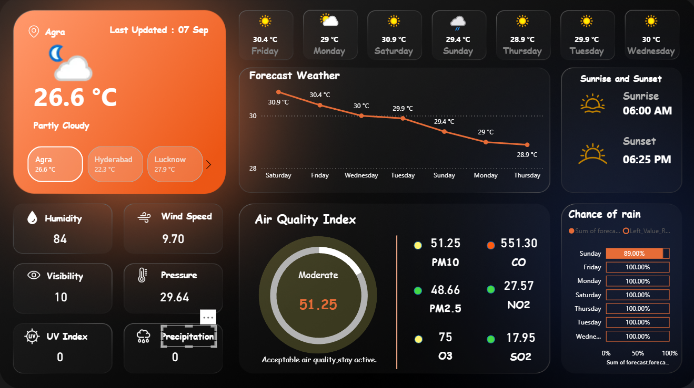

# 🌦️ Weather Dashboard in Power BI  

This project is an **interactive Weather Dashboard** built in **Power BI** using a **Weather API**.  
It provides **real-time weather updates, forecasts, and air quality analysis** with clear and engaging visualizations.  

---

## 🚀 Features  

- 📍 **Location-based Weather** – Current temperature, humidity, pressure, wind speed, and visibility  
- 🌡️ **7-Day Forecast** – Line chart to track temperature changes over the week  
- 🌅 **Sunrise & Sunset** – Daily timings  
- ☔ **Chance of Rain** – Probability of rainfall with detailed day-wise percentages  
- 🌍 **Air Quality Index (AQI)** – PM10, PM2.5, CO, NO2, O3, and SO2 levels  
- 🔎 **User-Friendly Design** – Clean, modern Power BI interface  

---

## 🛠️ Tech Stack  

- **Power BI** – Data visualization & dashboard creation  
- **Weather API** – Real-time weather & forecast data  
- **DAX & Power Query** – Data transformation and calculations  

---

## 📸 Dashboard Preview  

  

---

## ⚡ How It Works  

1. Weather API provides **real-time and forecast data**.  
2. Power BI connects to the API, processes data via **Power Query**.  
3. DAX formulas used for calculations like rain probability & AQI classification.  
4. Dashboard auto-refreshes to show **latest weather conditions**.  

---

## 📊 Use Cases  

- 🌍 Daily weather monitoring  
- 📈 Data storytelling & visualization practice  
- 🧑‍💻 Learning project for **Power BI + API integration**  

---

## 🔗 LinkedIn Post  

I shared this dashboard on LinkedIn as part of my **Power BI projects journey**.  
Check out the post [here](#) *(replace with actual link once posted).*  

---

## 👨‍💻 Author  

**Suyash Singh**  
📌 *Turning data into insights with Power BI, Python, and Machine Learning.*  
